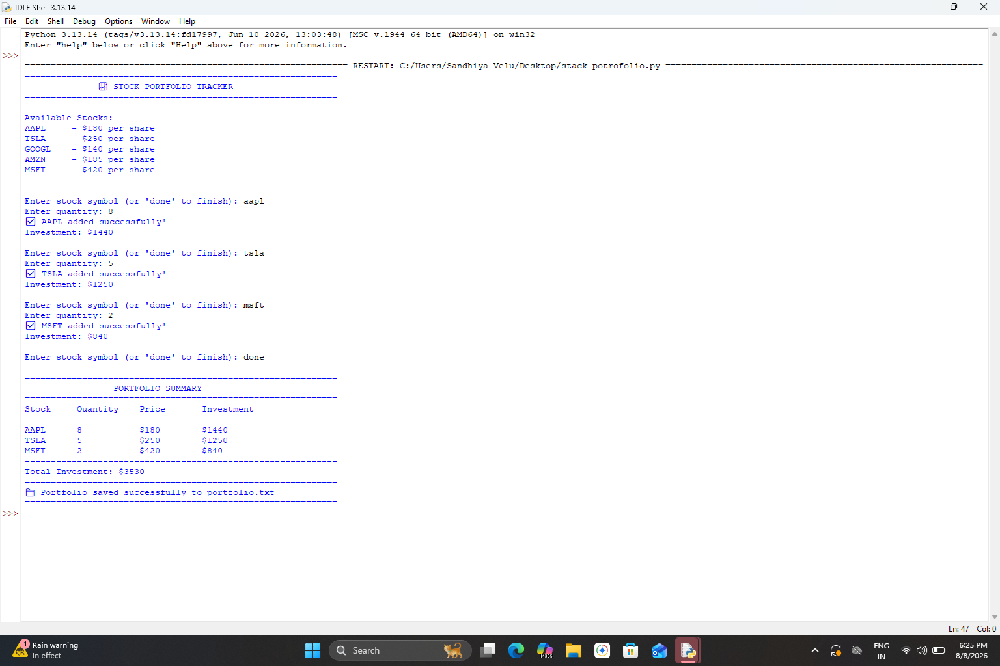

# CodeAlpha_Stock-Portfolio-Tracker
A professional Python-based Stock Portfolio Tracker to manage stock holdings, calculate investment value, and track portfolio performance.
# CodeAlpha Stock Portfolio Tracker

A professional Python-based Stock Portfolio Tracker developed as part of the CodeAlpha Python Programming Internship.

## Project Description

This project helps users manage their stock holdings and calculate important portfolio details such as total investment, current value, and profit or loss.

## Features

- Add stock holdings
- Calculate total investment
- Calculate current portfolio value
- Calculate profit or loss
- Display portfolio summary
- Simple and user-friendly interface

## Technologies Used

- Python
- Lists
- Dictionaries
- Functions
- Conditional Statements
- Basic Calculations

## How to Run

1. Open the project in Visual Studio Code.
2. Open `Stock_Portfolio.py`.
3. Run the Python program.
4. Enter the required stock details.
5. View the portfolio results.

 ## Author

**Sandhiya V**

## Output

The output of the Stock Portfolio Tracker is shown below:

